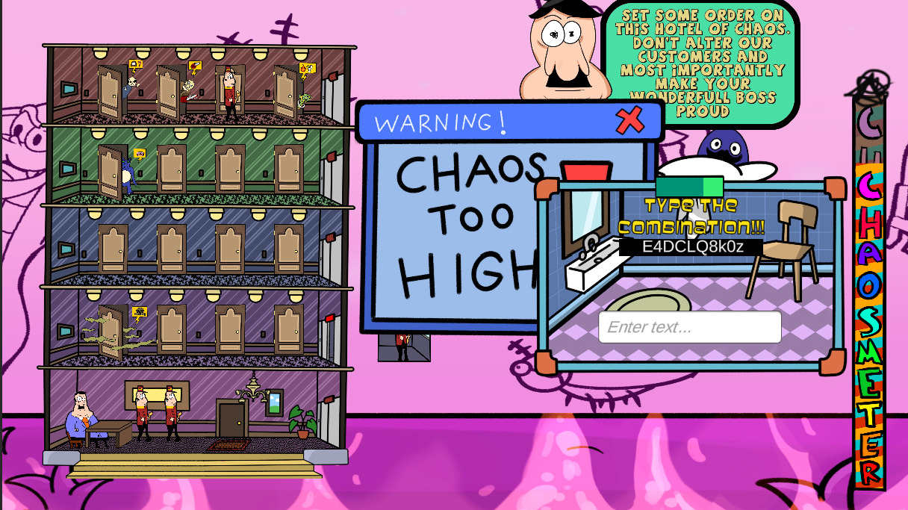

## What's Altered Hotel?

Altered Hotel is a game inspired in Wario Ware.

You are in charge of a chaotic hotel where many incidents happen all the time. Your objective?
Solve all the problems that your clients have in order to keep the hotel as calm as possible.

To achieve that objective you will have to solve many mini-games, however there is a twist!
The mini-games will appear constantly and simultaneausly! If you are too slow completing them,
you will be overwhelmed by all the mini-games appearing on your screen and the chaosmeter will
increase until your game over!

## What was my work?

During this project I was in charge of designing some of the different mini-games, as well as 
programming the logic of the Hotel controls and the algorithm of the appearance of the incidents.

If you want to download it, it's published in my itch.io: https://d1dii.itch.io/altered-hotel
