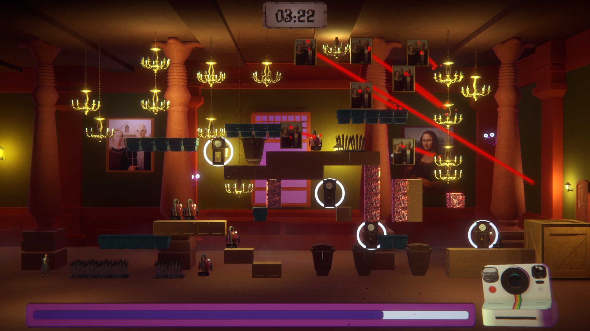

## What's Beyond the Shutter?

Beyond the Shutter is a 2D-Platformer with procedural generated levels inspired by the web-game Give Up! In this game you control 
an investigator in a spooky house trying to surpass all the obstacles and enemies. Each time you complete a level, 
a new obstacle will appear increasing the difficulty level until the chaos arrives! However, you have a magic camera
that has the ability to delete some of the obstacles on your paths!

## What was my work?

During the development of this project I was in charge of programming the procedural generation of the obstacles and the
design of some of the different obstacles that can appear.
