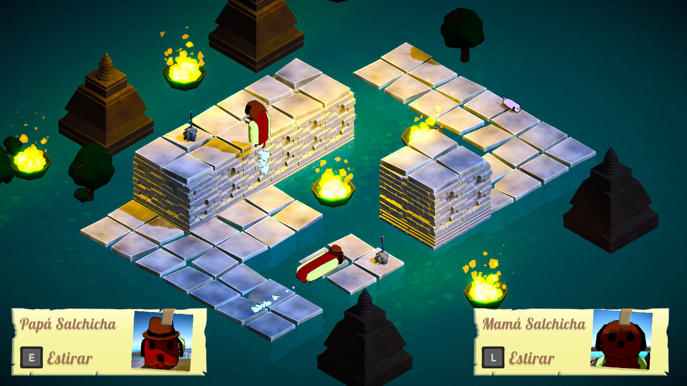

## What's Mi media salchicha?

Mi media salchicha is a cooperative multiplayer local puzzle game where you control a mother and father
sausages that have to rescue all their sons after a tragic accident during their hollidays.
This game has 15 different levels where you will have to cooperate with your partner to surpass all the obstacles!
Think wisely, the father is only able to stretch horizontally whereas the mother can stretch vertically, how will
you complete the levels?

This game was awarded the Best Design Award at the 9th CITM GameJam as well as 2nd place in the Best Game category!

## What was my work?

During this project I was in charge of developing the player controllers and all the different obstacles. I also
designed several levels of the game such as the level 10 and 15.

If you want to download it, it's published in my itch.io: https://lazy-gamedev.itch.io/mi-media-salchicha