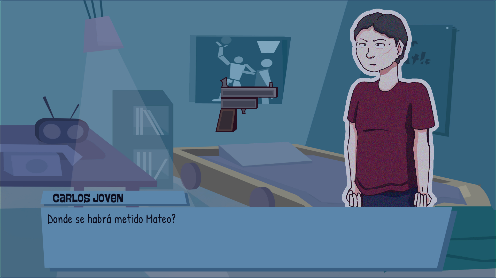
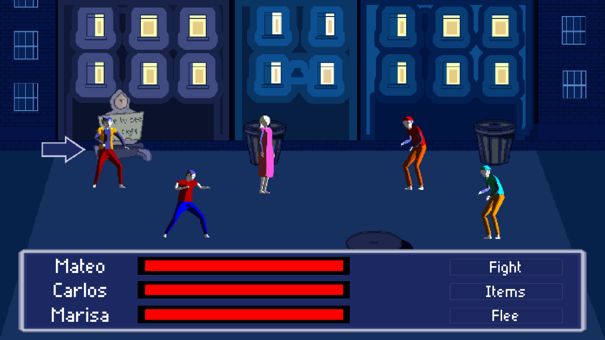

## What's Out of Jail?

Out of Jail is a narrative RPG where you follow the steps of Carlos just after
he's released from jail. How will he face his family and friends after all these years?
Which decisions are you going to make that will affect the story?

This game mixes turn-based combat with visual novels to bring you a unique experience.

## What was my work?

During the development of this GameJam project I was in charge of developing the dialogue
and decision making system, affecting the story and the combats. Also, I was part of the
narrative design, writing the story and the characters.

If you want to download it, it's published in my itch.io: https://d1dii.itch.io/out-of-jail
