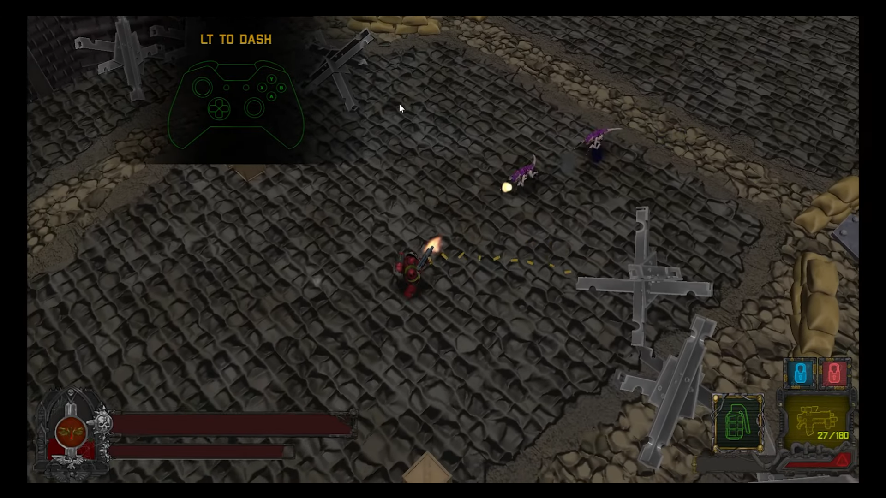
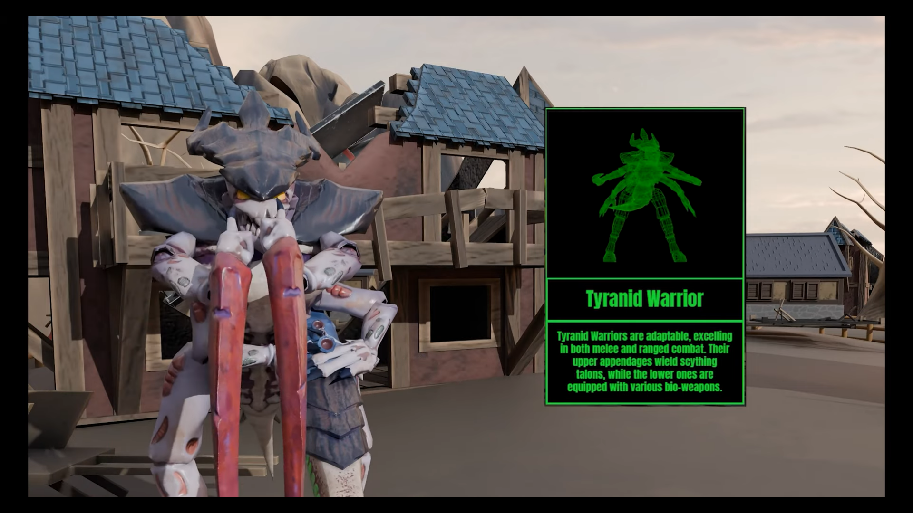

## What's Warhammer 40K: Blood and Thunder?

Warhammer 40K: Blood and Thunder is an ambitious class project involving +20 people developing a 
top-down shooter based in the Warhammer 40K universe using our own videogame engine. This project was developed during 4 months
using a structure similar to a big studio, dividing all the students in 3 departments: Programming, Art
and Design.

## What was my work?

During this project I was part of the programming department. We had to develop our own game engine from scratch and I was a key
part of this, being in charge of implementing multiple modules such as Skeletal Animation and reworking the Audio module. Apart from
this, I developed key mechanics of the game such as the weapon system, the poweup system, the checkpoints and the enemy spawners.

This great project was key on the development of myself as a videogame developer, as I learned a lot of knowledge as well as how to work
in an organized environment, having to deal with all the communication issues and the exhaustion of a long-term project.

This is my contribution page: https://crucibleb-t.github.io/webpage/DidacGarcia.html